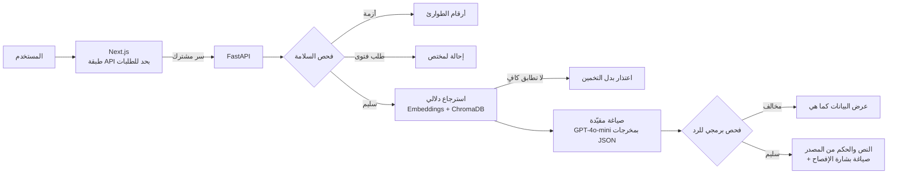

<div dir="rtl">

<p align="center">
  <b>﴿لَقَدْ كَانَ لَكُمْ فِي رَسُولِ اللَّهِ أُسْوَةٌ حَسَنَةٌ﴾</b>
  <br>
  <sub>سورة الأحزاب: 21</sub>
</p>

<h1 align="center">أُسوة</h1>

<p align="center">
  مواقف من السيرة النبوية لتحديات حياتك، موثّقة بالمصدر ومدعومة بالذكاء الاصطناعي
</p>

<p align="center">
  <a href="https://oswah.vercel.app"><b>جرّب المنصة</b></a>
  ·
  <a href="https://oswah-backend.onrender.com/api/health">حالة الخادم</a>
  ·
  <a href="Oswah_Presentation.pdf">العرض التقديمي</a>
</p>

مشروع مشارك في **تحدي الذكاء الاصطناعي في خدمة المحتوى الإسلامي**
**المسار:** الحوار المعرفي والإجابات الموثوقة

---

## المحتويات

- [المشكلة](#المشكلة)
- [الحل](#الحل)
- [آلية العمل وتوظيف الذكاء الاصطناعي](#آلية-العمل-وتوظيف-الذكاء-الاصطناعي)
- [المصادر الشرعية وكيفية التحقق منها](#المصادر-الشرعية-وكيفية-التحقق-منها)
- [ضوابط السلامة والموثوقية](#ضوابط-السلامة-والموثوقية)
- [البنية التقنية](#البنية-التقنية)
- [التشغيل المحلي](#التشغيل-المحلي)
- [النشر](#النشر)
- [الاختبارات](#الاختبارات)
- [سجل الأدوات والتراخيص](#سجل-الأدوات-والتراخيص)
- [البيانات والخصوصية](#البيانات-والخصوصية)
- [حدود المشروع](#حدود-المشروع)
- [خطة الاستمرار](#خطة-الاستمرار)
- [الفريق](#الفريق)

---

## المشكلة

- **فجوة التطبيق:** تُقرأ السيرة النبوية أحداثاً تاريخية، ولا تُربط بمواقف يومية مثل الغضب والإحراج والقلق وخلافات العمل والبيت.
- **أحاديث بلا تحقق:** تنتشر نصوص منسوبة للنبي ﷺ دون مصدر أو حكم، ويصعب على غير المتخصص التحقق منها.
- **أدوات عامة غير موثوقة:** روبوتات المحادثة العامة قد تخترع حديثاً أو مصدراً، وتخلط الشرح الآلي بالنص الشرعي.
- **الأطفال بلا محتوى مناسب:** يحتاج الأطفال قصصاً وألعاباً بلغتهم تغرس محبة النبي ﷺ والصحابة، من مصادر موثّقة.

## الحل

تصف موقفك، فتجد موقفاً نبوياً ثابتاً بنصه ومصدره وحكمه، ثم خطة عملية لـ24 ساعة.

| الخدمة | ما تقدّمه |
|---|---|
| **موقف مماثل من السيرة** | يطابق موقف المستخدم بموقف نبوي موثّق، ويعرض النص والمصدر والحكم كما وردت، مع عبرة وخطوة عملية وخطة من ثلاث خطوات لـ24 ساعة ومؤشر التوازن القيمي للخطة. |
| **تحقّق من صحة حديث** | يقارن النص المتداول بالموسوعة الحديثية ويعرض الحكم كما ورد عن المحدّث، أو يصرّح بعدم العثور على تطابق موثوق. |
| **ابحث عن حديث** | بحث مباشر بالنص أو بعض كلماته، ويعرض النتائج بنصها وراويها ومصدرها وحكم المحدّث، دون أي تدخل من الذكاء الاصطناعي. |
| **براعم أُسوة** | قسم للأطفال: قصص مسموعة بأصوات مولّدة عبر ElevenLabs، وقصص تفاعلية، ولعبة «صِل الصحابي»، وسؤال وجواب، وألبوم شارات. |

ومن مزايا الواجهة: العربية والإنجليزية، ومستويات شرح مختلفة، والوضعان الفاتح والداكن، وصورة قابلة للمشاركة لكل نتيجة.

## آلية العمل وتوظيف الذكاء الاصطناعي

المبدأ الأعلى: **الذكاء الاصطناعي لا يمسّ النص الشرعي.** النص والمصدر والحكم تُقرأ من البيانات وتُعرض كما هي، والنموذج اللغوي يختار ويصوغ فقط.



1. **فحص السلامة قبل أي بحث:** إن دلّ النص على أزمة نفسية تُعرض أرقام الطوارئ، وإن كان طلب فتوى في حالة شخصية يُحال المستخدم إلى جهة مختصة، وإن سأل «هل أنت شيخ؟» تُفصح المنصة عن طبيعتها.
2. **الاسترجاع الدلالي:** يُحوَّل وصف الموقف إلى متجه (`text-embedding-3-small`) ويُبحث في قاعدة متجهات (ChromaDB) مبنية من قاعدة مواقف أُسوة، مع حد أدنى للتشابه؛ إن لم يبلغه أي موقف تعتذر المنصة.
3. **الصياغة المقيّدة:** يرى النموذج (`gpt-4o-mini`) حقولاً غير شرعية فقط (العنوان والوسوم والعبرة)، ولا يرى نص الحديث أو الآية، ويُطلب منه مخرج JSON محدد.
4. **الفحص البرمجي:** يُرفض أي رد يحتوي ألفاظ أحكام (حلال، حرام، يجوز...) أو أوصافاً جسدية للنبي ﷺ أو الصحابة أو اقتباساً لحديث، وتُعرض البيانات عندها كما هي في القاعدة.
5. **العرض الموثّق:** يُعرض النص الشرعي ومصدره وحكمه من البيانات، وتُوسم الصياغة الآلية بـ«مُعدّ بمساعدة الذكاء الاصطناعي».

في **«تحقّق من صحة حديث»** يكتب النموذج عبارات البحث ويختار النص المطابق من النتائج، ولا يرى الأحكام أصلاً؛ الحكم يُنسخ برمجياً من المصدر. أما **«ابحث عن حديث»** فلا يستخدم الذكاء الاصطناعي إطلاقاً.

## المصادر الشرعية وكيفية التحقق منها

اعتمدنا مصادر من «المرجعية والحزمة العلمية» للتحدي:

| المصدر | كيف نستخدمه | كيف نتحقق منه | الحالة |
|---|---|---|---|
| الموسوعة الحديثية – [الدرر السنية](https://dorar.net) | نص الحديث وحكمه في «تحقّق» و«ابحث عن حديث» | الحكم يُنسخ برمجياً من رد الدرر، والنموذج لا يراه | الواجهة الرسمية: [dorar.net/article/389](https://dorar.net/article/389) |
| قاعدة الكتب السبعة المحلية | بديل تلقائي عند تعذّر الوصول إلى الدرر | نص الحديث وحكم المحدّث كما في المصدر (الألباني للسنن) | مفعّلة في النسخة الحالية |
| صحيح البخاري وصحيح مسلم | نصوص المواقف في قاعدة أُسوة | الكتاب ورقم الحديث والراوي والدرجة ورابط الدرر لكل موقف | 13 موقفاً مكتمل التوثيق |
| القرآن الكريم – مصحف المدينة النبوية | الآية المرتبطة بكل موقف | اسم السورة ورقم الآية، دون إعادة صياغة | مرجع ثابت |
| المتخصصة الشرعية في الفريق | مراجعة كل موقف قبل نشره | حالة لكل موقف (مرشّح ← معتمد) وبوابة محتوى تمنع غير الموثّق | قيد الاعتماد النهائي |

**قاعدة مواقف أُسوة** (`backend/data/asowa_complete_integration_.xlsx`) يحررها الفريق وتراجعها المتخصصة الشرعية، وفيها لكل موقف: الملخص، والنص الأصلي كما ورد، والكتاب، ورقم الحديث، والراوي، والدرجة، ورابط الدرر، والآية المرتبطة، والوسوم، ومستوى الحساسية، وحالة المراجعة. لا يدخل الفهرس إلا ما اكتمل توثيقه (`CONTENT_GATE=documented`)، ويمكن قصره على المعتمد شرعياً فقط (`CONTENT_GATE=approved`).

**مصدر الحديث** يُضبط بالمتغير `HADITH_SOURCE`: القيمة `auto` (الافتراضية) تبحث في الدرر وتنتقل تلقائياً إلى القاعدة المحلية إن تعذّر الوصول إليها، و`dorar` للدرر فقط، و`local` للمحلية فقط. القاعدة المحلية تُبنى بالسكربت `backend/scripts/build_local_hadith.py`.

## ضوابط السلامة والموثوقية

وفق المعيار العلمي الملزم في «المرجعية والحزمة العلمية»:

- **الموثوقية والإسناد:** كل نص شرعي يُعرض بمصدره وحكمه كما ورد، ويُفصل بصرياً عن الصياغة الآلية.
- **مقاومة الهلوسة:** عند غياب تطابق كافٍ تعتذر المنصة بدل توليد إجابة غير موثّقة، ولا يُنسب حديث دون مصدر وحكم.
- **عدم الاستقلال بالفتوى:** أسئلة الأحكام في الحالات الشخصية تُحال إلى جهة إفتاء أو مختص مؤهل.
- **الشفافية:** كل صياغة آلية موسومة «مُعدّ بمساعدة الذكاء الاصطناعي»، والمنصة تُفصح عن طبيعتها عند السؤال.
- **عدم التجسيد:** لا توصف ملامح النبي ﷺ أو الصحابة، ويُرفض أي رد يتضمن ذلك.
- **مقاومة حقن التعليمات:** نص المستخدم يُعامل بيانات لا أوامر.

## البنية التقنية

| الطبقة | التقنية |
|---|---|
| الواجهة | Next.js 14 (App Router) + صفحة تفاعلية كاملة في `frontend/public/index.html` |
| طبقة API في الواجهة | مسارات Next.js على الخادم، بحد للطلبات، وتمرير السر المشترك |
| الخادم | Python 3.11 + FastAPI + Uvicorn |
| النموذج اللغوي | OpenAI `gpt-4o-mini` (مخرجات JSON) |
| التضمين والاسترجاع | OpenAI `text-embedding-3-small` + ChromaDB |
| بيانات الحديث | واجهة الدرر السنية، وقاعدة الكتب السبعة المحلية بديلاً |
| الصوت | ElevenLabs (القصص المسموعة في براعم أُسوة) |
| الاستضافة | Vercel (الواجهة) + Render (الخادم) |

```
├─ backend/                       خادم FastAPI
│  ├─ main.py                     التطبيق، /api/health، /api/vector-search («موقف مماثل»)
│  ├─ hadith_check.py             /api/hadith-check («تحقّق») و /api/hadith-find («ابحث عن حديث»)
│  ├─ local_hadith.py             البحث في قاعدة الكتب السبعة المحلية
│  ├─ core.py · deps.py           المنطق المشترك، والبرومبتات، والفحص البرمجي، والإعدادات
│  ├─ scripts/build_local_hadith.py
│  ├─ data/                       قاعدة مواقف أُسوة + قاعدة الأحاديث المحلية
│  └─ requirements*.txt · .env.example
├─ frontend/                      Next.js
│  ├─ public/index.html           واجهة المنصة كاملة
│  ├─ app/api/{health,wisdom,hadith-check,hadith-find}
│  ├─ lib/server/oswahBackend.ts  الاتصال بالخادم وحد الطلبات
│  └─ .env.local.example
├─ tests/run_tests.py             اختبارات الخلفية (تعمل دون إنترنت)
├─ render.yaml                    نشر الخادم على Render
└─ run-backend.bat · run-frontend.bat
```

**مسار الطلب:** المتصفح ← Next.js (`/api/...`) ← FastAPI ← الدرر السنية / القاعدة المحلية + OpenAI.
لا يصل أي مفتاح سري إلى المتصفح، ولا يقبل الخادم إلا الطلبات التي تحمل السر المشترك.

## التشغيل المحلي

**المتطلبات:** Python 3.11 (يعمل 3.10 إلى 3.12)، وNode.js 20 (الحد الأدنى 18.18)، ومفتاح OpenAI.

### الطريقة الأسرع (Windows)

1. انقر مرتين على `run-backend.bat`: ينشئ البيئة ويثبّت الحزم وينشئ `backend\.env`. ضع فيه `OPENAI_API_KEY` ثم شغّله مرة ثانية.
2. انقر مرتين على `run-frontend.bat`.
3. افتح http://localhost:3000

### بالأوامر

```powershell
# الخادم
cd backend
py -3.11 -m venv .venv
.\.venv\Scripts\Activate.ps1
pip install -r requirements-excel.txt
copy .env.example .env        # ثم ضع OPENAI_API_KEY
uvicorn main:app --port 8000
```

```powershell
# الواجهة (نافذة ثانية)
cd frontend
copy .env.local.example .env.local
npm install
npm run dev
```

للتأكد: http://localhost:8000/api/health يجب أن يعرض `"ready": true`، وhttp://localhost:3000/api/health يجب أن يعرض الخادم متصلاً.

### متغيرات البيئة

| المتغير | المكان | الوصف |
|---|---|---|
| `OPENAI_API_KEY` | الخادم | مفتاح OpenAI (مطلوب) |
| `SITUATION_SOURCE` | الخادم | `excel` قاعدة مواقف أُسوة (المستخدم في النسخة المنشورة)، أو `dorar` |
| `HADITH_SOURCE` | الخادم | `auto` (افتراضي) أو `dorar` أو `local` |
| `CONTENT_GATE` | الخادم | `documented` أو `approved` |
| `SIMILARITY_THRESHOLD` · `TOP_K` | الخادم | حد التشابه وعدد المرشحين للاسترجاع |
| `OPENAI_CHAT_MODEL` · `OPENAI_EMBED_MODEL` | الخادم | `gpt-4o-mini` و`text-embedding-3-small` |
| `BACKEND_SHARED_SECRET` | الخادم والواجهة | سر مشترك بأحرف إنجليزية، بالقيمة نفسها في الطرفين |
| `PY_BACKEND_URL` | الواجهة | رابط الخادم، مثل `http://localhost:8000` |

القيم الكاملة في `backend/.env.example` و`frontend/.env.local.example`.

> إن ظهرت رسالة «running scripts is disabled» عند `Activate.ps1`، نفّذ مرة واحدة: `Set-ExecutionPolicy -Scope CurrentUser RemoteSigned`، أو استخدم موجه الأوامر cmd بالأمر `.venv\Scripts\activate.bat`.

## النشر

- **الخادم على Render:** New ← Blueprint ← هذا المستودع؛ يقرأ `render.yaml` تلقائياً. أدخل `OPENAI_API_KEY` و`BACKEND_SHARED_SECRET`.
- **الواجهة على Vercel:** Root Directory = `frontend`، مع المتغيرين `PY_BACKEND_URL` (رابط Render) و`BACKEND_SHARED_SECRET`.

الخطة المجانية في Render تُطفئ الخادم بعد 15 دقيقة بلا استخدام، فيتأخر أول طلب بعدها قرابة دقيقة.

## الاختبارات

```powershell
backend\.venv\Scripts\python.exe tests\run_tests.py
```

تعمل دون إنترنت ودون مفاتيح، وتغطي: تحليل ردود الدرر، وتصنيف الأحكام، وفحص السلامة، والفحص البرمجي لردود النموذج، وبوابة المحتوى، والقاعدة المحلية. النتيجة الحالية: **66/66 ناجحة**.

## سجل الأدوات والتراخيص

| الأداة / المصدر | دورها في أُسوة | الترخيص / الشروط |
|---|---|---|
| OpenAI `gpt-4o-mini` و`text-embedding-3-small` | فهم الموقف والتضمين والصياغة | خدمة مدفوعة وفق شروط OpenAI؛ لا يُرسل إليها النص الشرعي ولا الأحكام |
| واجهة الدرر السنية | نص الحديث وحكمه ومصدره | مجانية بلا مفتاح؛ نطلب إذن الاستخدام من المؤسسة |
| [hadith-api](https://github.com/fawazahmed0/hadith-api) (fawazahmed0) | قاعدة الكتب السبعة المحلية | ملكية عامة (Unlicense) |
| ElevenLabs | توليد صوت الراوي للقصص المسموعة | الخطة المجانية وفق شروط ElevenLabs |
| FastAPI · Uvicorn · Pydantic · httpx | الخادم والتحقق من الطلبات | MIT · BSD-3 |
| ChromaDB · openpyxl | قاعدة المتجهات وقراءة قاعدة المواقف | Apache-2.0 · MIT |
| python-dotenv · BeautifulSoup | الإعدادات وتحليل الردود | BSD-3 · MIT |
| Next.js · React | واجهة المستخدم والربط بالخادم | MIT |
| Render · Vercel · GitHub | الاستضافة والمستودع | الخطط المجانية |

## البيانات والخصوصية

- لا تُسجَّل نصوص المستخدمين في سجلات الخادم، ولا تُخزَّن.
- يُطلب من المستخدم عدم كتابة أسماء أو بيانات شخصية.
- ما يُحفظ في متصفح المستخدم فقط: اللغة والمظهر ومستوى الشرح وتقدم الأطفال والخطوات المنجزة.
- لا توجد في المستودع مفاتيح سرية أو بيانات مستفيدين؛ ملفات `.env` مستثناة عبر `.gitignore`.

## حدود المشروع

- المنصة أداة مساعدة للتعلّم والاستلهام، وليست مصدراً للفتوى.
- مواقف القاعدة الحالية (13 موقفاً مكتمل التوثيق) بانتظار الاعتماد الشرعي النهائي، وتُعرض بحالتها «مرشّح».
- «موقف مماثل» يغطي ما في القاعدة الموثّقة فقط، ويعتذر خارجها.
- الوصول إلى الدرر من خوادم الاستضافة محجوب حالياً بحماية Cloudflare، وتعمل القاعدة المحلية بديلاً تلقائياً.

## خطة الاستمرار

- [x] منصة تعمل على رابط مباشر، واختبارات آلية ناجحة
- [ ] الاعتماد الشرعي للمواقف وإكمال توثيق القاعدة
- [ ] توسيع القاعدة إلى أكثر من 100 موقف من المصادر المعتمدة
- [ ] ترجمات معتمدة وتوسيع براعم أُسوة
- [ ] تجربة مع مدارس وأسر، وتكامل مع منصات المحتوى

## الفريق

| الاسم | الدور |
|---|---|
| حنين هيثم القصير | قائدة الفريق، التطوير التقني والذكاء الاصطناعي |
| غلا محمد الرشيدي | تطوير الباك إند |
| أثير شعيفان الحربي | تطوير الواجهات والتطبيقات |
| نوف تركي التركي | تصميم تجربة المستخدم |
| الماس المشيقح | المراجعة الشرعية والمعرفية |

## شكر وتقدير

شكراً لمنظمي التحدي وشركائه: باذل، ووزارة الاتصالات وتقنية المعلومات، والهيئة السعودية للبيانات والذكاء الاصطناعي (سدايا)، والتحول التقني، وآفاق المستقبل (Future Frontiers).

</div>
